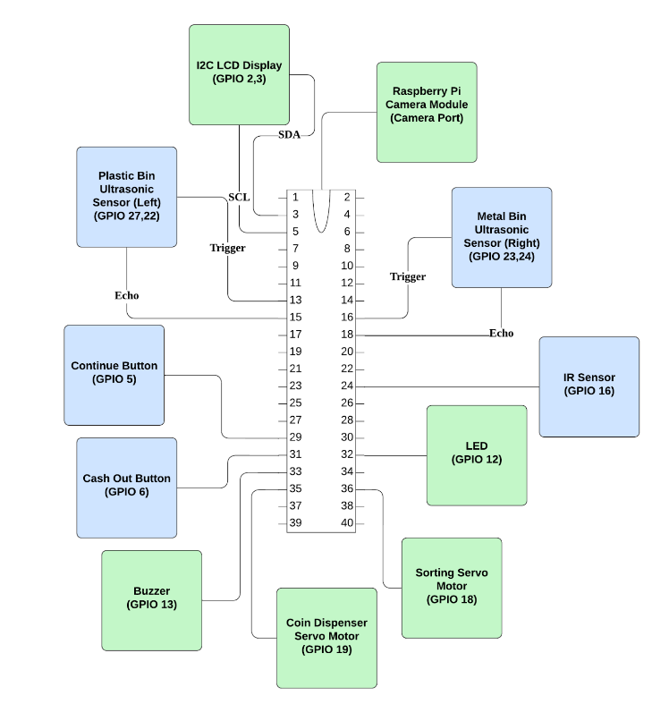
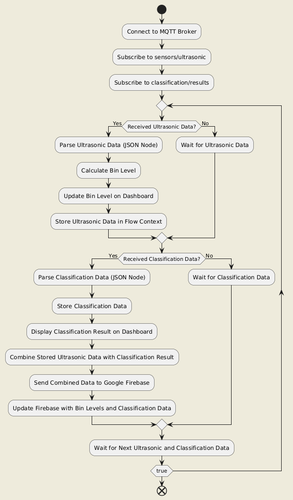
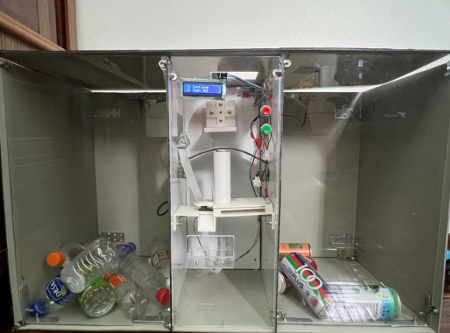
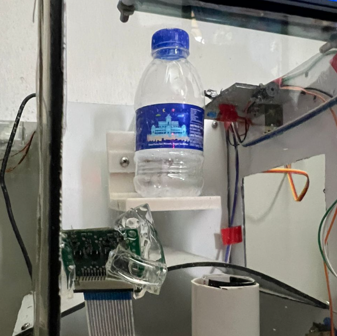
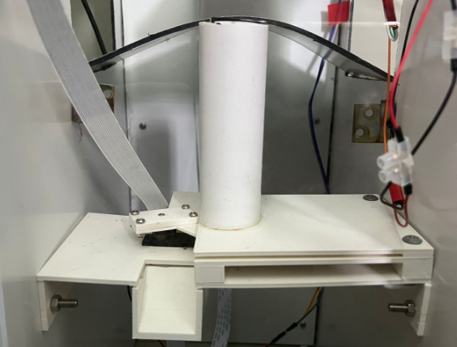
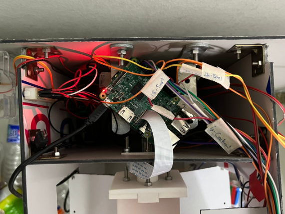
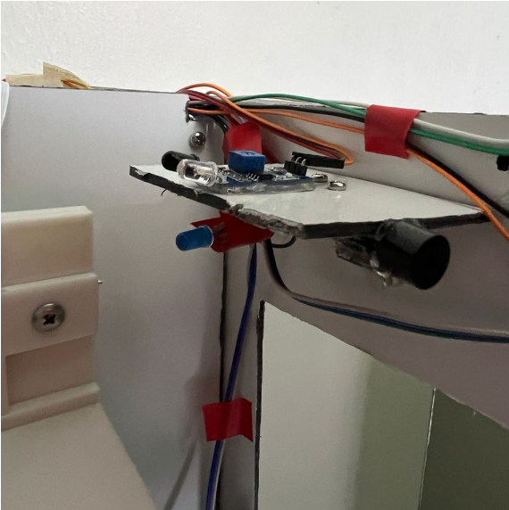
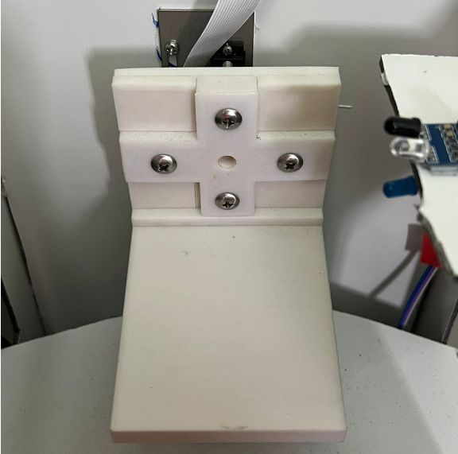
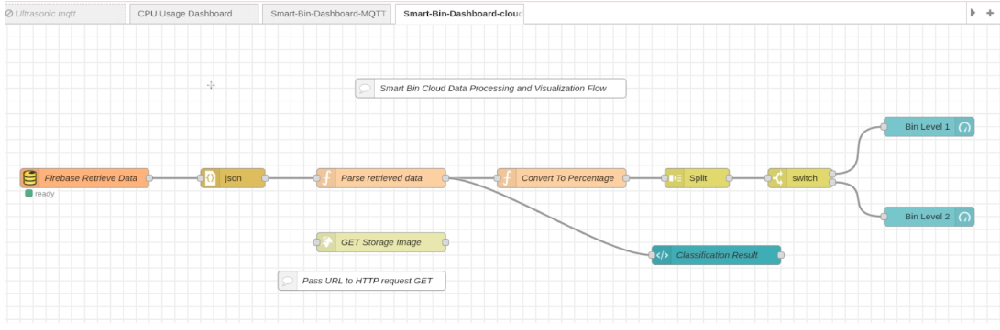
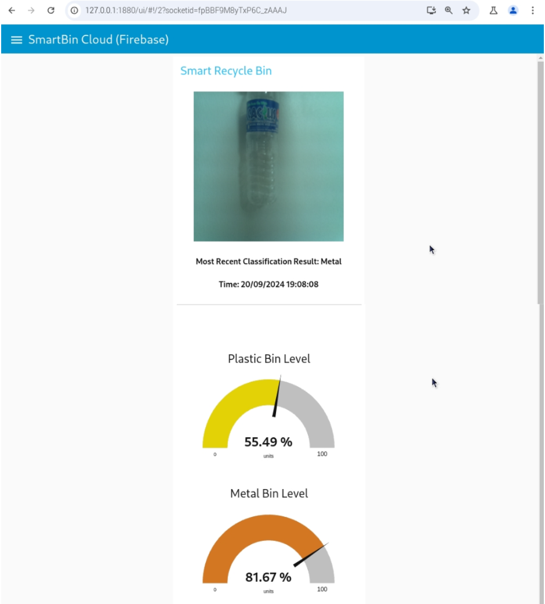

# Smart Recycling Bin with Image Classification and Raspberry Pi Integration

This project features a smart reverse recycling bin that uses a camera and image classification (MobileNetV2) to automatically sort waste into plastic or metal. The image classifier is fine-tuned with real images from the prototype.

The system runs on two Raspberry Pi devices:

- Raspberry Pi 1 controls the bin’s sensors, handles waste classification, and sends data through MQTT.
- Raspberry Pi 2 subscribes to MQTT topics, uploads data to Firebase, and displays it on a real-time dashboard built with Node-Red.

## System Design

Raspberry Pi 1

Raspberry Pi 2

## Prototype

## Visualization

